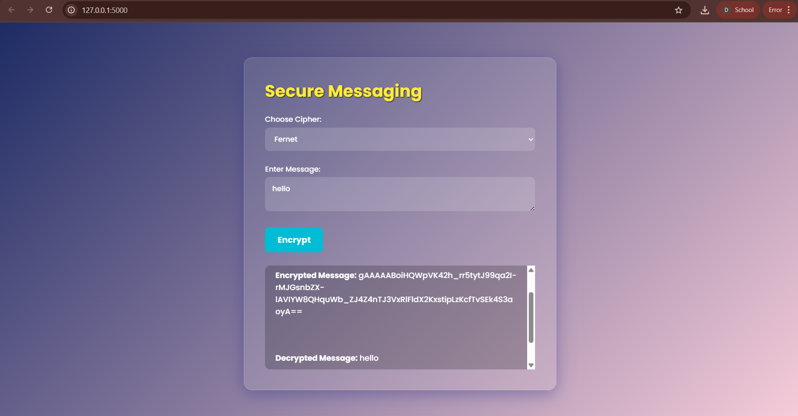
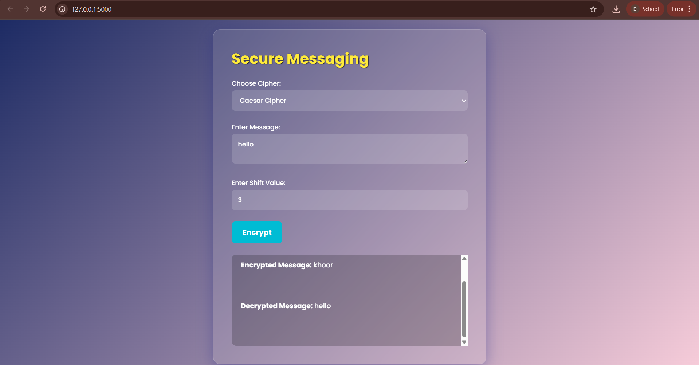

```markdown
# 🔐 Secure Messaging Web App using Fernet and Caesar Cipher

A Flask-based secure messaging web application that allows users to encrypt and decrypt messages using **Fernet Encryption** and the **Caesar Cipher**.

> 💡 Choose between **strong encryption (Fernet)** or **classical learning cipher (Caesar)** to secure your messages in a stylish, interactive web interface.

---

## ✨ Features

- 🔐 **Fernet Encryption** (AES + HMAC + base64)
- 🧠 **Caesar Cipher** (Simple character shifting)
- 🖥️ **Responsive Web UI** with animations
- 🔄 Real-time AJAX communication
- 📜 Displays both encrypted and decrypted messages

---

## 📁 Project Structure

```

secure\_messaging\_app/
├── app.py                # Flask backend
├── secret.key            # Fernet key file (auto-generated)
├── templates/
│   └── index.html        # UI Template
├── static/
│   ├── style.css         # Stylish CSS
│   └── script.js         # JavaScript for interactivity
└── README.md

````

---

## 🚀 Getting Started

### 📦 Prerequisites

- Python 3.x
- pip

### 🔧 Installation

```bash
# 1. Clone the repository
git clone https://github.com/yourusername/secure-messaging-app.git
cd secure-messaging-app

# 2. Install dependencies
pip install flask cryptography

# 3. Run the Flask app
python app.py
````

Now open your browser and go to:
`http://127.0.0.1:5000`

---

## 📷 Screenshots


```



```

---

## 🔍 How It Works

### Fernet Encryption

* Uses AES in CBC mode
* Adds HMAC for integrity
* Base64 encodes the output
* Key must be kept safe for decryption

### Caesar Cipher

* Each letter is shifted by a fixed number
* Used mostly for educational purposes
* Not secure, but easy to understand

---

## 📚 Learn More

* [Fernet Encryption (docs)](https://cryptography.io/en/latest/fernet/)
* [Caesar Cipher (Wikipedia)](https://en.wikipedia.org/wiki/Caesar_cipher)
* [Flask Documentation](https://flask.palletsprojects.com/)

---
